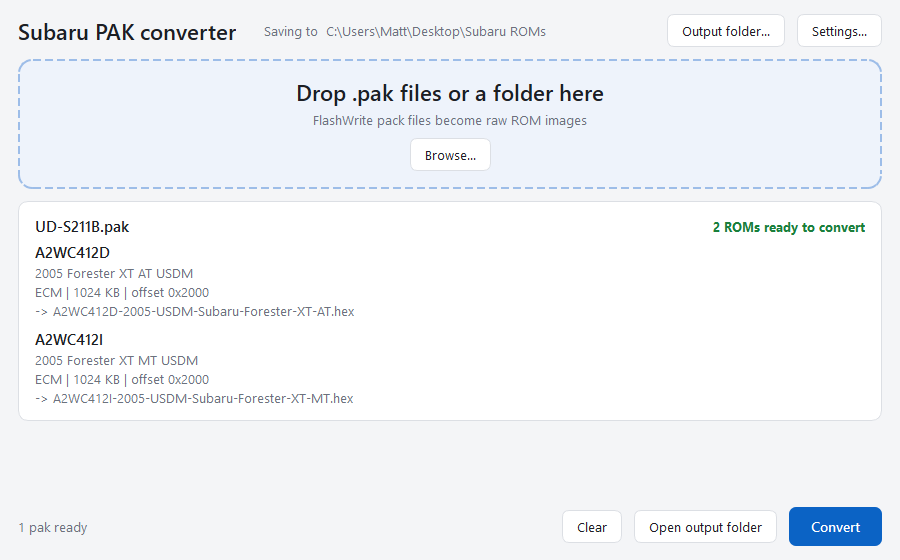
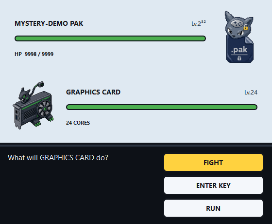

# Pak2Bin

**Turn a Subaru FlashWrite `.pak` into a flashable ROM (`.bin` / `.hex`). Drag, drop, done.**

## ⬇ Download

### **[Download Pak2Bin for Windows »](https://github.com/MattPerser/Pak2Bin/releases/latest/download/pak2bin.exe)**

One file. No install. Double-click it.

## Use it



1. **Open `pak2bin.exe`.** Windows may warn *"Windows protected your PC"* — click **More info → Run anyway** (it's unsigned, not unsafe).
2. **Drag your `.pak` onto the window.**
3. **Click Convert.** Your ROM lands in the output folder. That's it.

### No key on file?

If a pak's key isn't known, hit **⚔ Battle for the key** and let it run — Pak2Bin
brute-forces it. It's a real fight (and yes, your graphics card gains Exp).



---

<details>
<summary><b>Command line, Python library, and how it works</b></summary>

### Command line

```bash
pak2bin convert <pak>... --out DIR     # convert, auto-named
pak2bin info <pak>...                   # what's inside, writes nothing
pak2bin recover <pak>                   # brute-force the key for an unknown pak
pak2bin keys                            # list the swap-cipher keys it knows
```

`convert` flags: `--json`, `--hex`/`--bin`, `--no-name`, `--key HEX`, `--db PATH`,
`--swap-key NAME`, `--download 0x2000`, `--fix-checksum`, `--recover`, `--dry-run`.
Exit codes: `0` all converted, `1` something failed, `2` usage error.

### Python

```bash
pip install .            # from a clone
```
```python
from subaru_pak import convert_pak
for rom in convert_pak("22765AJ13F.pak").roms:
    open(rom.filename, "wb").write(rom.data)
```

### How a pak becomes a ROM

A `.pak` is an MFC `CArchive` holding S-record files, each **RC2-encrypted** with
the pack's key; the ROM inside is encrypted again with Denso's **swap cipher**.
Pak2Bin unwraps the container, RC2-decrypts, parses the S-records, detects and
applies the swap key, lays the cal region into an `0xFF`-filled image at its flash
offset, and validates the subarudbw checksum. Both ciphers are pure-Python
reimplementations, verified bit-exact against known-good conversions.

### The pack database

Pak2Bin does **not** ship Subaru's pack database (their proprietary key list). It
reads that from a local FlashWrite install if you have one, or you can pass
`--db`/`--key`. Without it, an unknown pak is opened by brute-force (the Battle).

### Key recovery

Both the RC2 keyword and an engine ROM's swap key are recoverable by brute force
(each a 2³² search — minutes, not millennia, thanks to free known-plaintext).
Module swap keys are not brute-forceable from erased flash alone. Recovered keys
are remembered for next time.

### Build it

```powershell
pip install -e ".[dev,gui,fast]"
pytest
.\packaging\build.ps1 -Cli -NoDatabase   # produces dist\pak2bin.exe
```

`swapcipher.py` reimplements the Denso cipher from
[FastECU](https://github.com/miikasyvanen/fastecu) by Miika Syvänen.

</details>

## Licence

MIT — see [LICENSE](LICENSE). Read and convert files you are licensed to use;
flashing a modified ROM is at your own risk.
